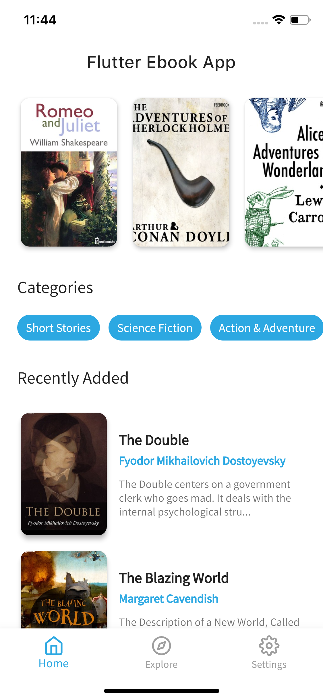
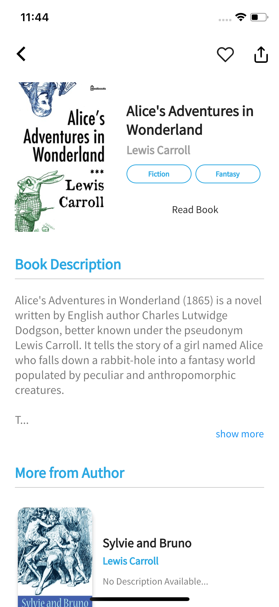
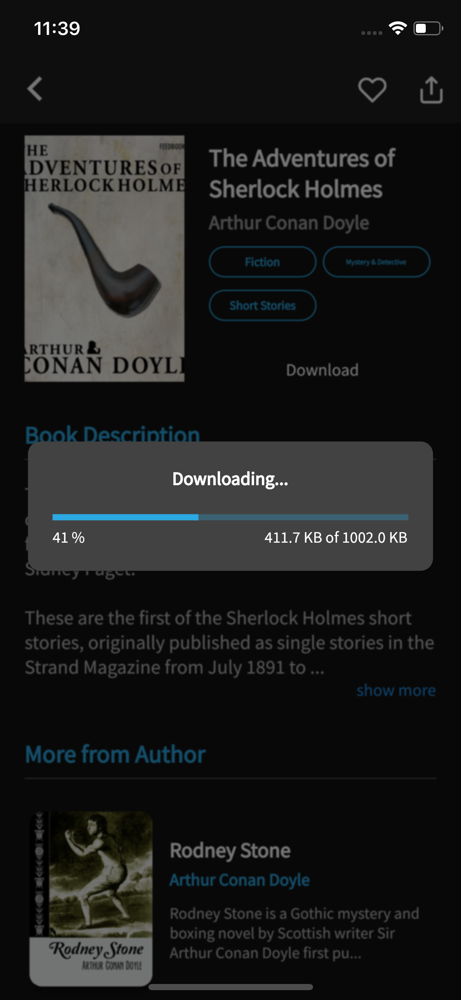
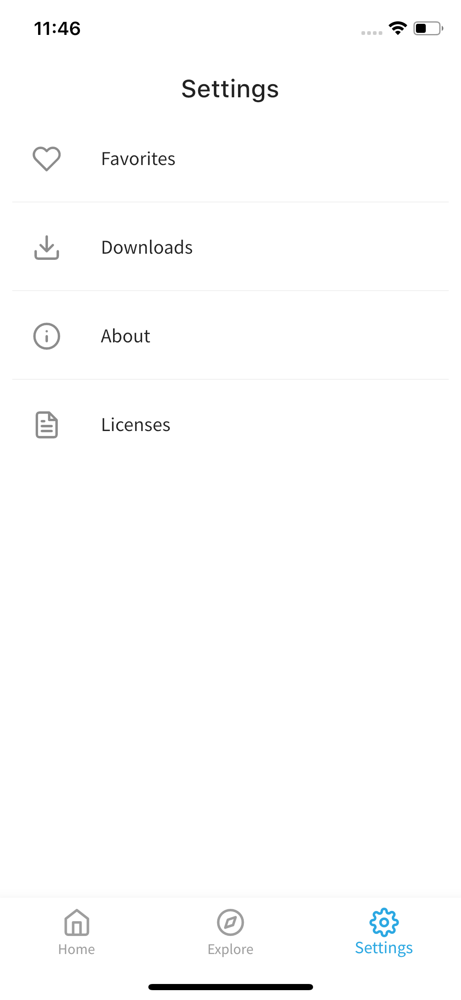

# 📖📖 Flutter eBook App

A simple Flutter app to Read and Download books. The Books included in the app
are from the [Public Domain](https://en.wikipedia.org/wiki/Public_domain)
(Expired Copyright and completely free).

 

The [Feedbooks API](http://www.feedbooks.com/api) was used to fetch books.  
 
<a href="https://www.vecteezy.com/vector-art/599678-book-reading-logo-and-symbols-template-icons">App
icon</a>    You can choose to install the `apk` or the `ipa(ios)`.

  Please star⭐ the repo if you like what you see😉.

## 💻 Requirements

- Any Operating System (ie. MacOS X, Linux, Windows)
- Any IDE with Flutter SDK installed (ie. IntelliJ, Android Studio, VSCode etc)
- A little knowledge of Dart and Flutter

## ✨ Features

- [x] Download eBooks.
- [x] Read eBooks.
- [x] Favorites.
- [x] Dark Mode
- [x] Swipe to delete downloads.

## 📸 ScreenShots

  

| Light                             | Dark                              |
| --------------------------------- | --------------------------------- |
|   |   |
|   |   |
|   |   |
|   |   |
|   |  |
|  |  |
|  |  |

## 🔌 Plugins

| Name                                                    | Usage                                               |
| ------------------------------------------------------- | --------------------------------------------------- |
| [**Provider**](https://pub.dev/packages/provider)       | State Management                                    |
| [**Object DB**](https://pub.dev/packages/objectdb)      | NoSQL database to store Favorites & Downloads       |
| [**XML2JSON**](https://pub.dev/packages/xml2json)       | Convert XML to JSON                                 |
| [**DIO**](https://pub.dev/packages/dio)                 | Network calls and File Download                     |
| [**EPub Viewer**](https://pub.dev/packages/epub_viewer) | A flutter plugin for Folioreader to read ePub files |

## 🤓 Author(s)

**SURAJ ABUBAKAR RAMADAN**

## 🔖 LICENCE

[Apache-2.0](https://github.com/sadiqabubakar526/FlutterEbookApp/blob/master/LICENSE)
